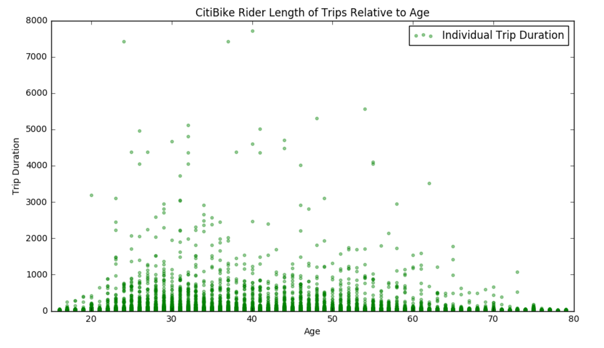

Hello Benjamin, Good job with the plots!
I understand you have evaluated the Trip Duration for the Age of the Subscriber type of Citibike riders and you have used Scatter Plot functionality to plot this information.

# Comments:

1) The plot is clear and aesthetic. You have listed labels for both X and Y axis. I suggest to add units along with the labels. For X Axis, Age unit can be inferred to years. It would be a good practice to mention it.

2) For Y Axis, you have scale with increments in 1000's. It would be helpful to convert this value into Minutes which will make it easy for the reader to absorb the analysis.

3) From you code, I infer you have considered August 2015 month data and restricted to consider only Subscriber type of riders with age constraint of less than 80 years old. I recommend you mention these details on the plot to enable the reader understand the constraints applied in code.

4) You have provided Title for this plot. In addition, providing Figure number and details below the plot would be a good practice. This caption can cite the restrictions you have applied in the code.

5) I also recommend that you provide your take and conclusion below the graph. This will complete the message that you want to convey through your plot.

Thank you.