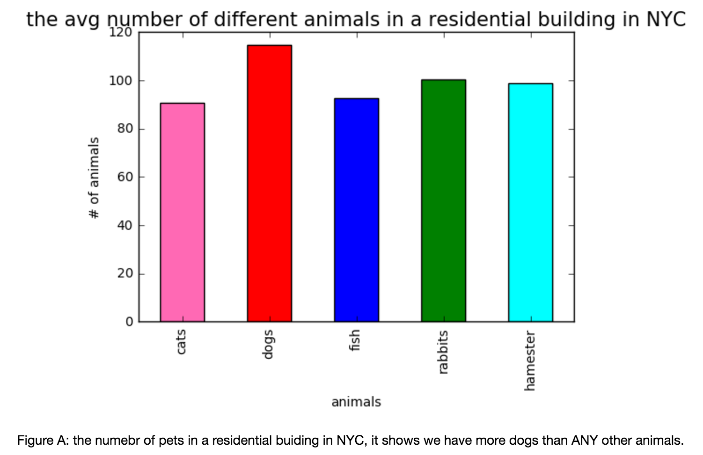

Hello Pooneh, Good job on plotting the Analysis of the Different types of Pets in the Residential Buildings in NYC to conclude that Dogs are more in number (on average) than other types of pets.

# Comments:

1) The plot is clear. Labels are visible. Title and Figure details are listed.

2) As I understand the column graphs are color coded for aesthetic purpose only. As they do not give any additional significant information, I recommend to use same color for all columns to follow best practice of plotting.

3) The data is randomly generated for this exercise. Using real data would definitely make this analysis and following conclusion more interesting.

4) The size of the Title is very large compared to the graph. Some space between the title and plot would make it look good.
The Figure details provide your conclusion from the analysis - this is a good practice. Minor suggestion - Make it bold and increase font size proportionate to the graph.

5) For ease in readability, I recommend to use the X Axis - Pet Names to be at 45 degree angle instead of showing it vertically. 

Thank you.